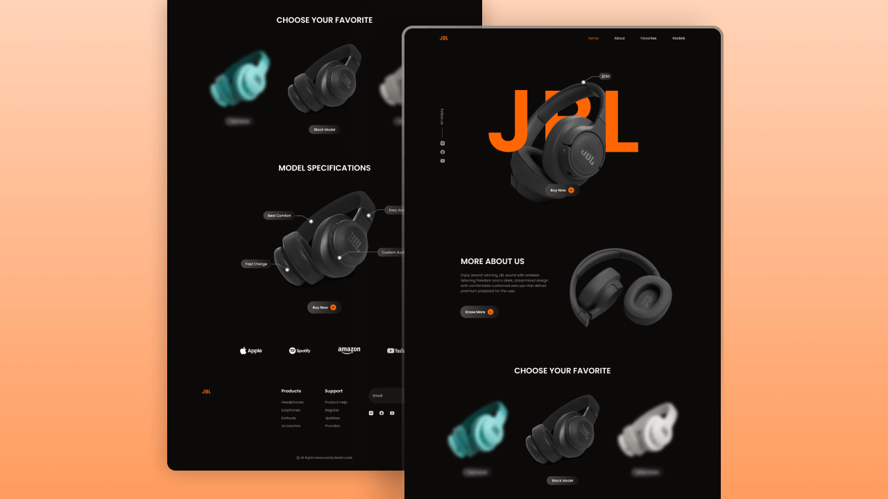

# Responsive Headphones Website

A sleek, fully responsive web application demonstrating front-end development skills. Built with clean HTML, CSS, and JavaScript, this project showcases a user-centric design with smooth interactions and cross-device compatibility. It highlights visually appealing, intuitive, and performant web experiences optimized for seamless user engagement.

**Live Website:** [https://kethnulee-weerasinghe.github.io/Responsive-Headphones-Website/](https://kethnulee-weerasinghe.github.io/Responsive-Headphones-Website/)



## Overview

This project aims to showcase strong UI and front-end skills via a mock e-commerce site for a headphone brand. The site adapts across devices, has animated scroll behavior, and provides a visually engaging browsing experience.

- Responsive design (desktop / tablet / mobile)  
- Product showcase with images and details  
- Model specifications and highlight features section  
- Navigation menu (Home, About, Favorites, Models)  
- Footer with social links and site info 

## Technologies Used

- HTML
- CSS
- JavaScript

## Running Locally

To view or edit the project locally:

```bash
git clone https://github.com/Kethnulee-Weerasinghe/Responsive-Headphones-Website.git
cd Responsive-Headphones-Website
```
